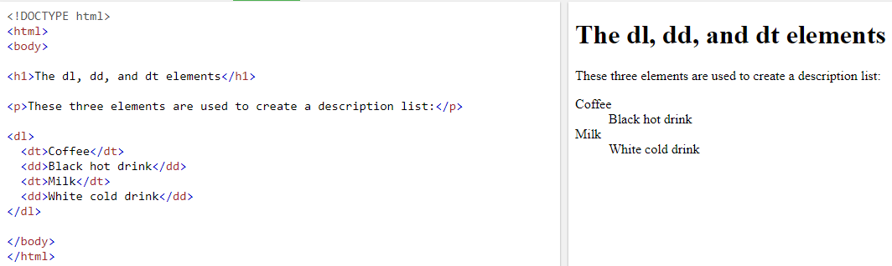

##  HTML Lists, CSS Boxes, JS Control Flow

###  Duckett HTML

#### Chapter 3: “Lists” (pp.62-73)

There are three types of lists in HTML:

1-Ordered list.

To add an ordered list, use the following commands:

```
<ol>
   <li<>item 1</li>
   <li<>item 2</li>      
   <li<>item 3</li>
          .
          .
          .
          etc
</ol>
``` 
where `<ol></ol>` indicates that this is an ordered list, and `<li></li>` the items in the list.


2-Unordered list.

```
<ul>
   <li<>item 1</li>
   <li<>item 2</li>      
   <li<>item 3</li>
          .
          .
          .
          etc
</ul>
``` 
where `<ul></ul>` indicates that this is an unordered list, and `<li></li>` the items in the list.


3-Definition list.

```
<dl>
   <dt<>term 1</dt>
   <dd>defintion 1</dd>

   <dt<>term 2</dt>
   <dd>defintion 2</dd>

   <dt<>term 3</dt>
   <dd>defintion 3</dd>
          .
          .
          .
          etc
</dl>
``` 
where `<dl></dl>` indicates that this is a definition list, `<dt></dt>` the term that you want to define, and `<dd></dd>` the defintion itself.



And of course you can add list inside of another list which we call *nested list*.

#### Chapter 13: “Boxes” (pp.300-329)

Every HTML element is surrounded by multiple boxes, padding, border, and margin, this is called the *box model*.

*Padding* is the area between the content of the element and the border.

*border* is the area between the padding and the margin.

*margin* is the area between the border and the margins of the other elements around.


You can apply multiple changes to these boxes in CSS by selecting the HTML element and select which box that you want in property segment; here is an example:


You can use the property `display` to change the way a list of items looks; here are some values that you can apply in `display`:

* `inline`: to display the items next of each other.
* `block`: to display the item in seperate box, it's best noticed when adding this property on word inside of paragraph.
* `inline-Block`: displays the item inline with other items and maintain the charateristics of the block feature.
* `none`: removes the item as if it was not there from the beginning.

It's worth to mention that there is property called `visiablity` and by using the value of `hidden` it hides the item but not the boxes.


### Duckett JS 

#### Chapter 2: “Basic JavaScript Instructions” (pp.70-73)

There are many ways to define array in JS, here is the preferred one:

`var arr=[1,2,3];`

Each item in the array is given an index number by default, starting from the number 0, so you refer to the second item in our example by `arr[1]`.


#### Chapter 4: “Decisions and Loops” from switch statements on (pp.162-182)

*Switch* is used when having a condition and there are many different possible outcomes, so it's more convenient to use *switch* than multiple *if else* statements.

On of the benefits of using *switch* over *if else* is switch faster since it doesn't check for statement with fault outcome.

```
switch(variable){
   case "value1":
     "statement1";
     break;
   
   case "value2":
     "statement2";
     break;
   
   case "vlaue3":
     "statement3";
     break;
        .
        .
        .
       etc
}
```
What switch will do is to check for the value of variable, and executes the statement with matching value, then it will exit the switch statement since there is break command without checking the next statements.


Loops in general are used when you want certain commands to be executed multiple times until certain condition is achieved.

The difference between while loops and for loops can be illustrated by showing the syntax for both commnads:

For Loops Syntax

```
for ("variable"="value 1";"variable" "comparsion operator" "value 2";"counter"){

    "the commands that you want them to be repeated";
}

``` 
The sequence of for loops is after "variable" is defined the condition statement will be checked if its resault was true the commands between the curly brackets get executed and then "counter" gets executed, and this goes on until the condition statement's results is false.


While Loops Syntax

```
while ("condition statement"){

    "the commands that you want them to be repeated";
}

``` 

While looops sequence is similar to for loops sequence, the commands will be executed after the condition statement is checked and the result is true, and this goes on until the condition statement's results is false.2


