###  HTML Images; CSS Color & Text

#### Chapter 5: “Images” (pp.94-125)

To add image in HTML use the following :

``

Some times the browser doesn't load the image, so if you want to show text that represents the image use the following:

``

To add description about the image when the user's cursor comes over the image the description appears, use the following:

``

Regarding the dimensions of the of the image you can use `hight="#px"` and `width="#px"`attributes.

Now, when editing the alignment of the text and the images use the attribute `align=left` to make the text on the left side of the image, and the same for the other 3 directions, but this attribute had been removed form HTML5 and replaced with float propert in CSS.

To add caption to an image use `<figure></figure>` to contain the image and the caption, and use `<figcaption>text<figcaption>` to add the caption itself, as following 

#### Chapter 11: “Color” (pp.246-263)

There are three ways to specify colors in CSS either by: name, hex, or rgb. You can use the property color to change the color of a certain text, and background property to change the background color, as following :

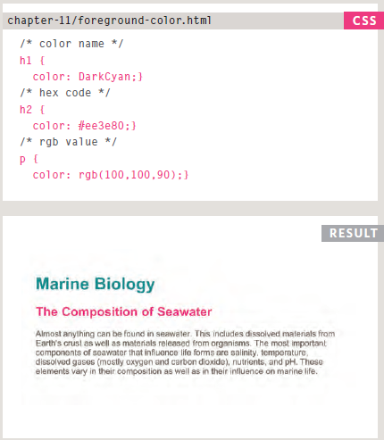

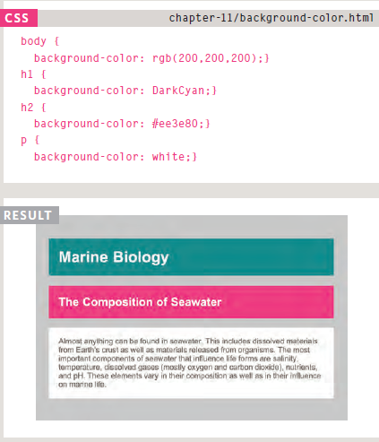

You can change the opacity of an element using the property opacity or rgba:

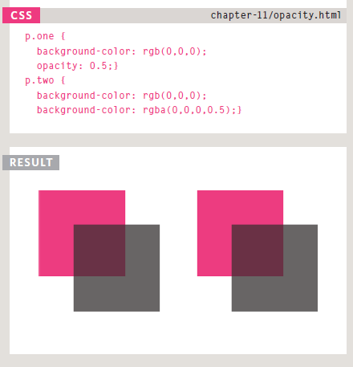

There are another way to specify the colors in CSS by using HSL or HSLA for adding opacity, H refers to the color itself, S for the saturation, L for the brightness, and A for opacity.

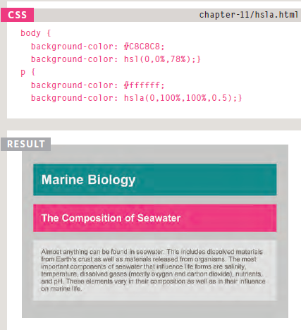

#### Chapter 12: “Text” (pp.264-299)

There are a lot of styling you can make on fonts using CSS, you can change the font family, font weight, sont size, the spacing between the letters, and font style, which we will be discussing later on.

`font-family: font name ;`

![font family])(img/5.PNG)

`font-size: the size that you want ;`

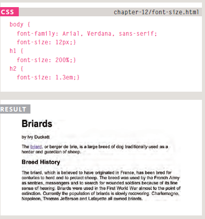

`@font-face` which allows you to use font even if it was not installed on the user's device, by linking the font using the url.

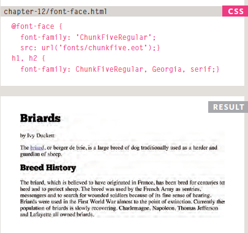

`font-weight: the weight;`

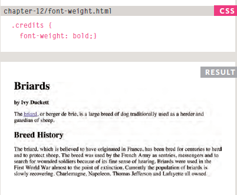

`font-style:style name;`

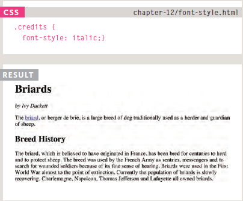

`text-transform: transformation that you want to make on a certain text;`

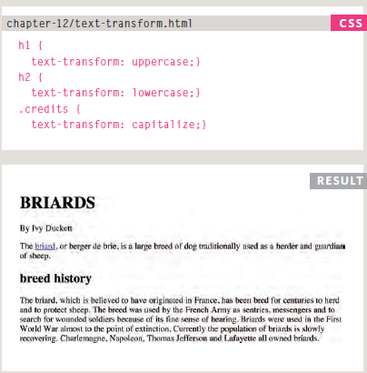

`text-decoration:;` usually it's used when you want to remove the underline of links.

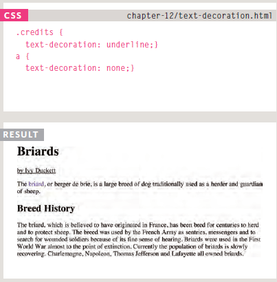

`letter-spacing:number;`

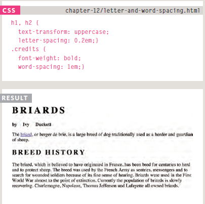

`text-shadow: #px #px #px color;` the first nember is how far for the left or to the right you want the shadow, the next is for top and bottom shadow effects, and the last one is for blur effect.

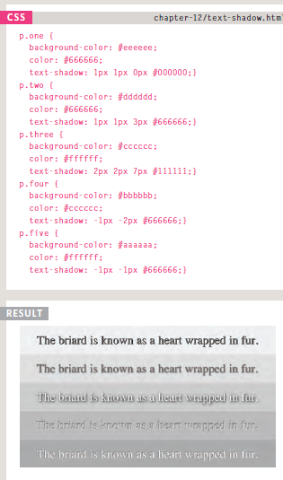

link and visited pseudo classes are used for editing linked texts:

`CSS selector:link{}`/ `CSS selector:visited{}`

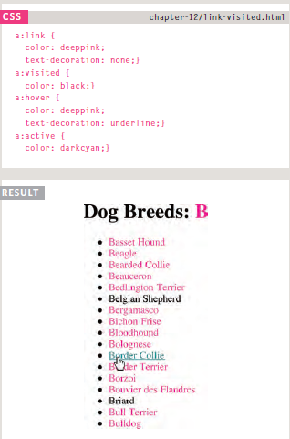