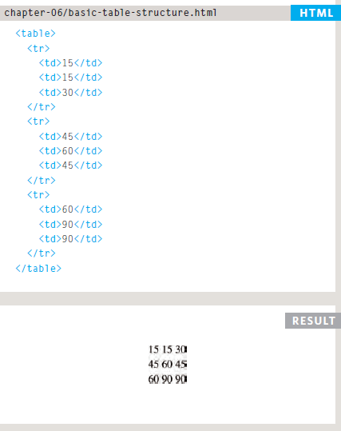
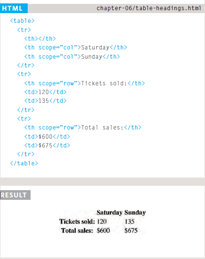
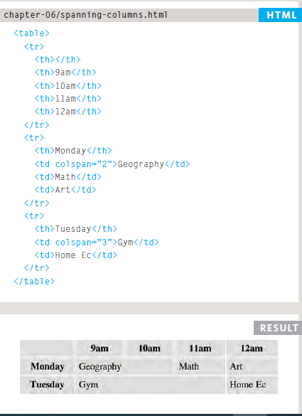
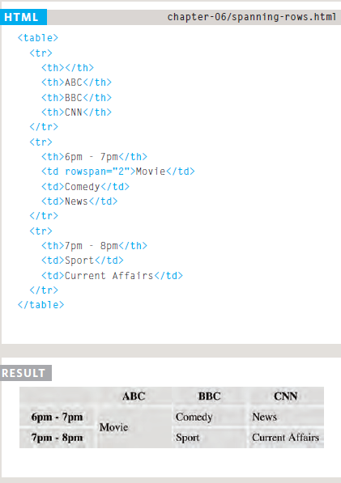
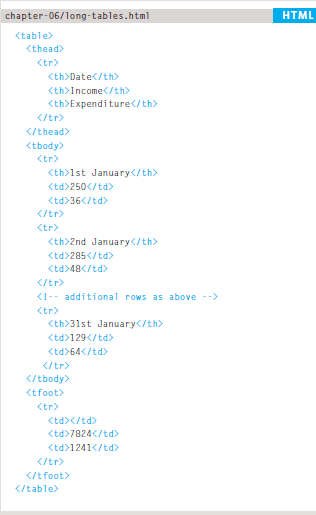
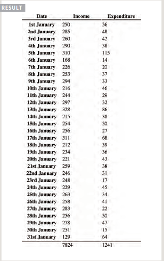

### HTML Tables; JS Constructor Functions

####  Duckett HTML book

##### Chapter 6: “Tables” (pp.126-145)

To add table in HTML you need 3 main elements:`<table></table>`, `<tr></tr>`, `<td></td>`, *tr* stands for table row, and *td* table data which adds column. 




Using the element `<th>` for table headings will make it much more readable, also you can use the attribute `scope="row"or"col"` to determine whether it's row or column heading.




`Colspan="number of cells"` and `row="number of cells"`determines how many rows and columns the cell run across.







For long tables you would use 3 extra elements;`<thead></thead>` for table headings, `<tbody></tbody>` for table body, and `<tfooter></tfooter>` for the bottom of the table similar to when adding a "total" heading at the bottom of the table.






#### Duckett JS Book

##### Chapter 3: “Functions, Methods, and Objects” (pp.106-144)

You can create an empty object that you can add content to it later in the code by using the keywords `new object()`, to add the content use the *dot notation*, as showed next:

```
var hotel=new object();

hotel.name='Quay';
hotel.rooms=40;
hotel.booked=25;

hotel.checkAvailability=function(){
    return this.rooms - this.booked;
};
```
You can also use `var hotel={};` for creating an empty object.

For editing object content you can use dot notation: `hotel.rooms=50;`, or `hotel['rooms']=45;`, and for deleting content use `delete hotel.rooms;`.

For creating an empty object template:

```
function hotel (name,rooms,booked){
    this.name=name;
    this.rooms=rooms;
    this.booked=booked;
    
    this.checkAvailability =function(){
        return this.rooms-this.booked;
    };
}
```
To add content to the template:

`var quayHotel=new hotel(Quay,40,25);`
