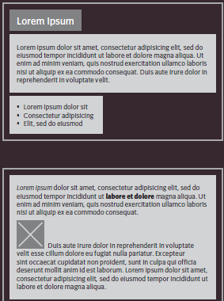
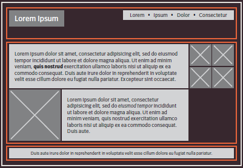

### More CSS Layou

#### Duckett HTML book:

##### Chapter 15: “Layout” (pp.358-404)

###### Position

CSS puts HTML elements inside of box that contains these elements, and these boxes are either inline level boxes or block level boxes.The following image at the top represents the block level boxes and at the bottom represents the inline level boxes

Usually the elements inside *header* and *nav* are put together inside of a box, and this can be done by containing them inside `

` which is a containing element.

In the following image, the orange boxes represents the *div* elements:

Now, let's talk about the box positioning, there are 3 controlling positioning schemes: **normal flow**, **relative flow**, **absolute flow**; the first one which is set by default which gives a positioning for the elements depending on their type and the box model that comes with their type, the second one positions the elements relative to their default position, whereas the last one sets the positioning relative to the page itself.

All of the above schemes (except for static)can be controlled by the offset properties (top,bottom,right, and left).

`position:static;`

`position:relative;`

`position:absolute;`

`position:fixed;`

Fixed is the same as absolute, but the no matter where you scroll the content remains at the same position.

`position:sticky;`

Sticky is simialr to fixed, but its position changes wihtout being scrolled out of your view.

`z-axis:"number of pixels";`

It controls the overlapping element, like if you want to control which element sets over another element.

##### Float

Float changes the position of the selected element without getting overlapped by other elements, there are 3 main values : right, left, and both.

Right positions the element to the right and the other contents to the left and vice versa for left, whereas both doesn't allow for the elements to overlap from both sides.

##### Clear

What clear does is, not allowing the selected elements to float next to the elements with float on the same side (clear and float have to be set on the same side for clear to work properly)

without clear:

with clear:

