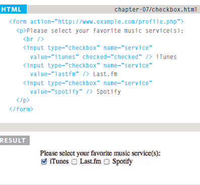
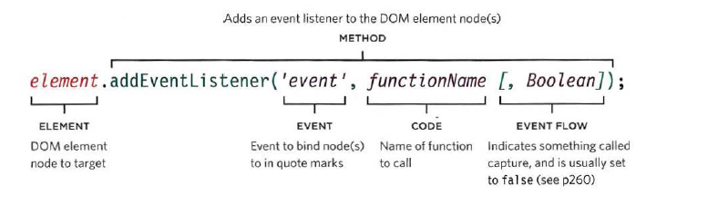

###  Forms and Events


#### Duckett HTML

##### Chapter 7: “Forms” (p.144-175)

Forms are ways of getting information from the user using HTML, HTML have many choices of forms; such as adding text, making choices, submit buttons, upload files ... etc.

To create forms use the following:

```
<forms>
    <input type="form type">
        <p>description</p>
    </input>
</forms>
```

Type attribute provides many options you can choose from; such as: text, password, radio button, checkbox, and upload files.

`type="text"`


`type="password"`


`type="radio"`


`type="checkbox"`




`type="file"`


To list of option use `<option></option>` inside of `<select></select>`, in the following image *name* and *value* attributes represent the date that will be sent to the server:


##### Chapter 14: “Lists, Tables & Forms” (pp.330-357)

CSS provides many options for ordered and unordered lists, you can change the style of list using the property `list-style-type` for both types of lists.


Also you can an image by using `list-style-image: url ("");`


To adjust the positioning of the text that extends to a new line, use `list-style-position: "inside or outsied";`, outsied starts the new line after the listing points and vice versa for inside.

`list-style-position: outside;`
`list-style-position: inside;`


Regarding table styles, you can change colors and font type and size the same way you would, if it was as normal text.

In CSS, you can hide empty cells by selecting the table and then use the property `empty-cells: hide;`


For lists styling, you can style them the same as you would if it was a normal text, that includes adding background image for the buttons, and you can also use pseudo classes such as hover, you can also change the border style and radius.


#### Duckett JS

##### Chapter 6: “Events” (pp.243-292)

Events are used when you want to make a response to the user action, these action might be pressing keyboard key, clicking on the mouse, pressing on a link, ... etc.

There are two ways for creating event:
1- DOM event handlers (we won't use it).
2- Event listeners:



This way doesn't include paramters inside the function that you want to call, here is how to create event using event listeners which includes funcion paramters:


###### Event Flow

Event can be triggered by triggering other events related to elements either containing that element or contained by it, and that is where the flow field when using event listeners approach.

When flow is set to true it means that the flow is set on event bubbling, and event capturing when it's set to false.


