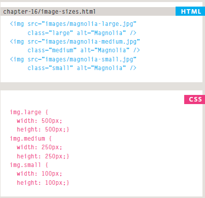
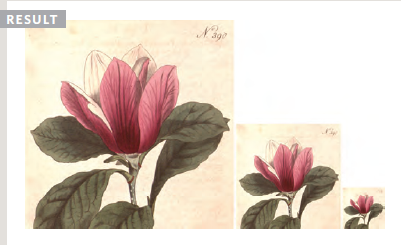
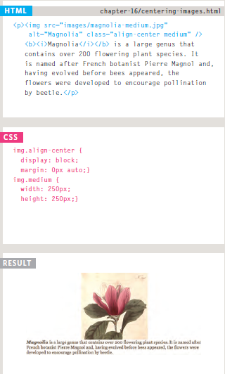
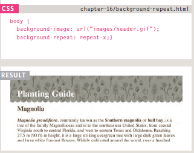
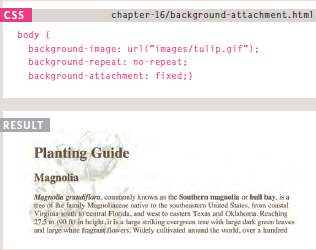
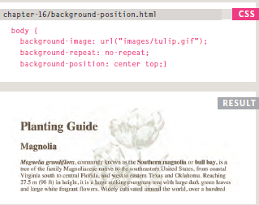
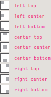

##  Assorted Topics

###  Duckett HTML book

#### Chapter 16: “Images” (pp.406-427)

You can control the size of an image by changing the width and the height properties in CSS

To center an image, you need to change their display property to block instead of the default value which is inline and then you can do one of two things:

* Change the text-align property of the containig element to center.
* Select the value auto of the property margin of the image.

When choosing an image background, You can choose between repeating the image or not assumming that the image size isn't big enough, this can be done by the property `background-repeat:;` as following:

When selecting no repeat there is a property called `background-attachment` where you can selecting between scrolling the image as the user scrolls or make it in fixed position

`Background-position` allows you change the position of the background and you can choose between 9 different positioins

#### Chapter 19: “Practical Information” (476-492)

