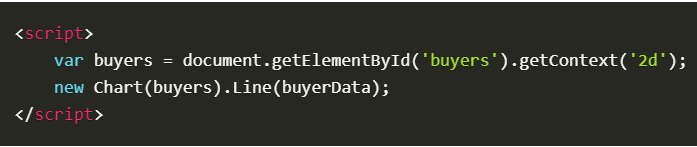
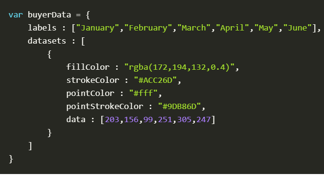
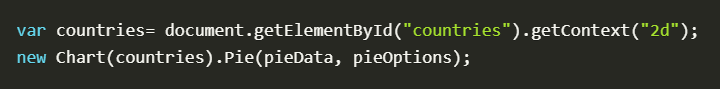
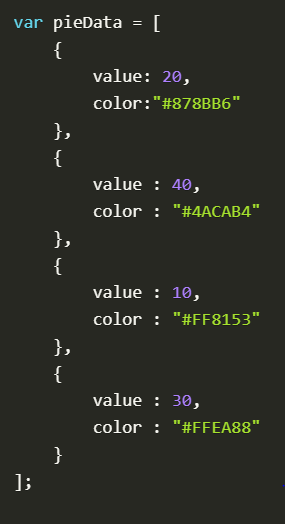
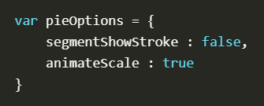
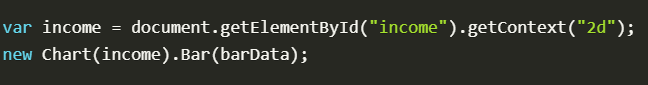
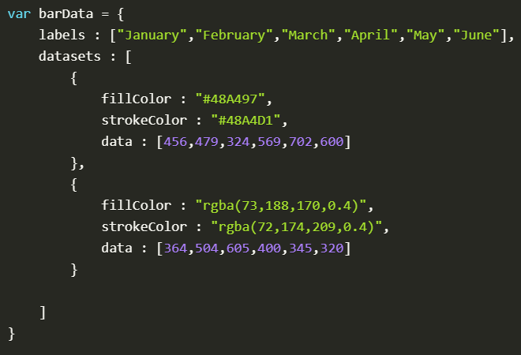

## Docs for the HTML <canvas> Element & Chart.js

### The <canvas> Element

Canvas element is basically a blank area that's added on your HTML page after adding canvas element, the blank area can be filled with different drawings -depending on the library that you link to your HTML page- using javascript.

### Chart.js API.

Before you learn how to create charts you need to download [chart.js](https://github.com/chartjs/Chart.js) and copy chart.min.js inside your directory, and then you need to link it in the HTML file:

``

Now, let's start with drawing single line chart, we're gonna use canvas element:

`<canvas id = "buyers" width="600" height="400"></canvas>`

Next, inside of script tags do the following:

Then, we're gonna write our data inside of an object:

For pie chart after creating canvas element as we did before, create the id *countries*, do the following:

For bar chart, after creating canvas element and creating id *income*, do the following:

