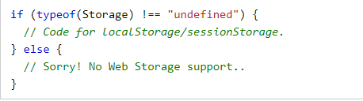
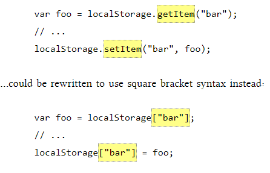
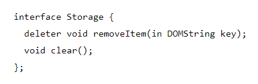
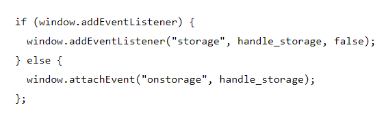
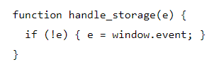

### Local Storage

HTML storage is a way for web applications to store data in your local device within your browser's storage, and unlike cookies it won't be sent to the web server. Which affects the performance and your internet speed significantlly.

HTML provides to objects to store data on the client's device:
`window.localStorage` data with no expiration date.
`window.sessionStorage` data expire after one session.

To check whether your browser support web HTML storage type the following code:

HTML storage supports every data type in javascript, but it's stored as string, so when retrieving the data you will need to use `parseInt()` or `parseFloat()`.

There are two ways in which you can change the data saved on a certain named key:

To remove the data on a certain named key:

To track changes to a certain named key, you can create a storage event to track the changes whether `setItem()`, `removeItem()`, or `clear()` were used or not, this can be done by following:

Where, the function *handle_storage*:

