## CSS Transforms, Transitions, and Animations

Transform property is a new property came with CSS3. Transform allows you apply changes on elements size and position simpler than the ways we learnt previously, these changes can be 2D and 3D.

### 2D Transform

#### Rotate 

Rotate takes both positive and negative values, where negative valuesrotates the element counter clockwise and positive values clockwise, as in the following examples:

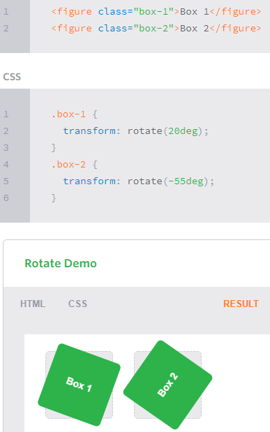

The grey squares are with no transform effects.

#### Scale

Scale default value is 1, so any value less than 1 will shrink the element. 

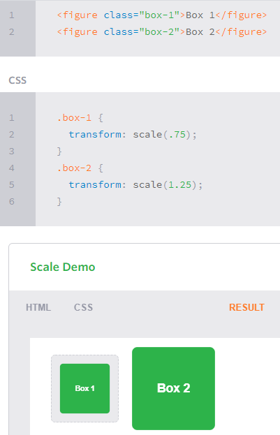

Also you can change width or height only:

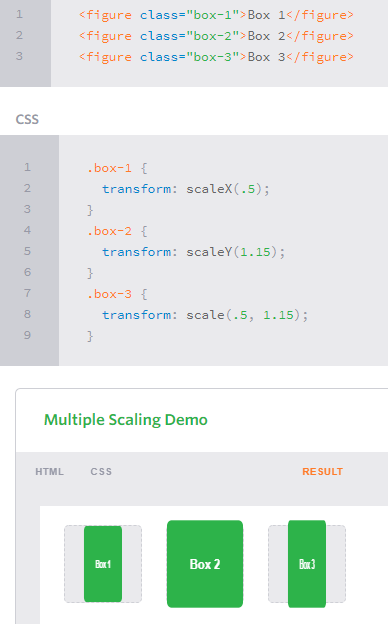

#### Translate

Think of translate as if the element was on the center of the cartesian coordinates, you can move the element towards all direction, where negative values moves the element either left or down and positive values right or up;

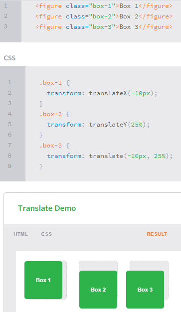

#### Skew

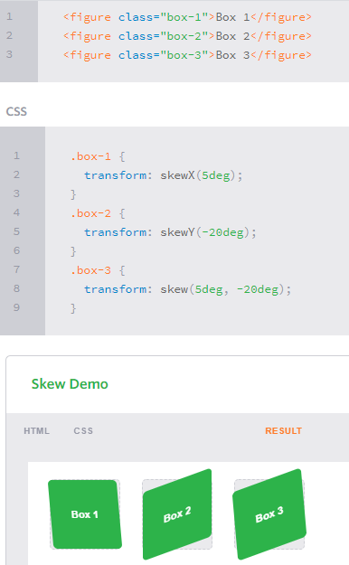

And by combining some of the previous properties:

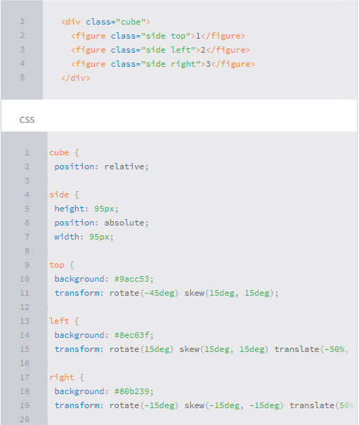

#### Transform Origin

The default origin value (50%,50%) on the cartesian coordinates. 

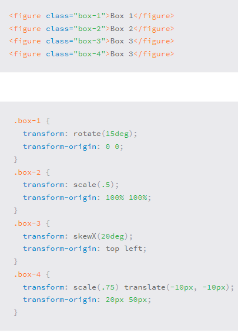

### 3D Trasnform

#### Perspective 

Think of perspective as the depth dimension or the distance between you and something else. Perspective can be used either as a property by its own or inside transform property. Perspective property has to be used with the other transform properties for it to get noticed.

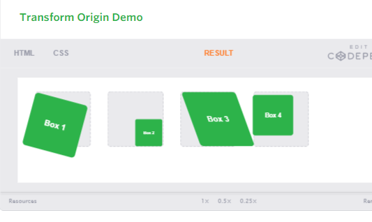

#### 3D Rotate

The same as 2D rotate but with the added Z-axis, X-axis controls the depth, Y-axis replaces the X-axis in 2D, and Z-axis replaces the Y-axis (3D cartesian coordinates). 

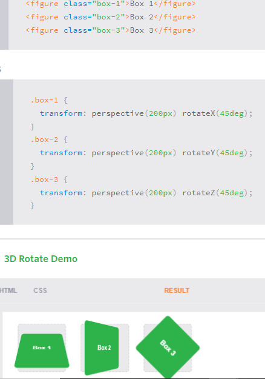

#### 3D Scale

It doesn't make sense to 3D scale a 2D object, So this property used with the other transform properties.

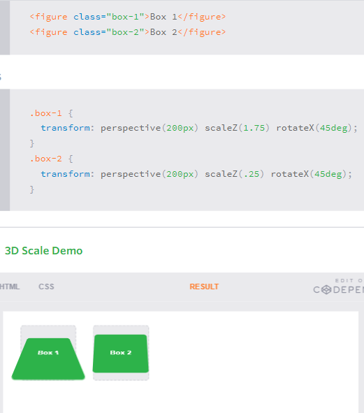

#### 3D Translate

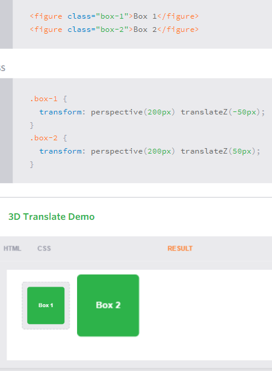

#### 3D Translate Origin

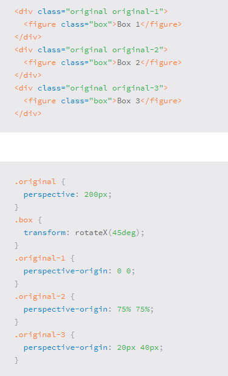

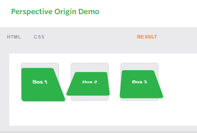

